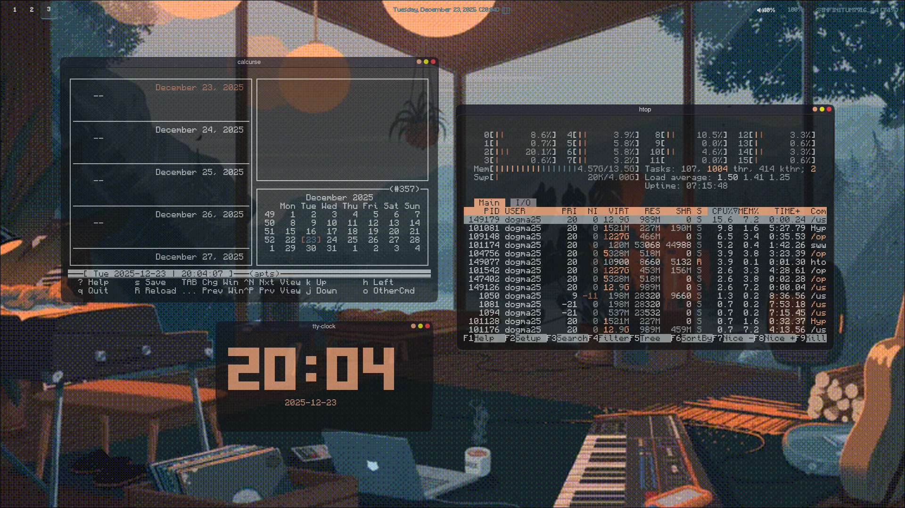

# my-arch hyprland setup

Hola, este es mi primera vez haciendo mi repositorio de Dotfiles. soy desarrollador no se si programador,tengo 15 y estoy aprendiendo c++ ocn las librerias SFML y Qt.
tambien estoy personalizando mi arch linux




## preview
>Mi setup utiliza un entorno minimalista, como ventanas flotantes y visualizadores de audio(**Glava god**)

* **OS** : arch linux
* **WM** : Hyprland
* **Terminal** : kitty (se habre con SUPER+Q)
* **bar** : waybar
* **Lanzador de aplicaciones** : rofi (se habre con SUPER+R)

## Tecnologías Adiciional
* **Editor**: Sublime Text 4 (Configuración en `sublime/`)
* **Colores**: Pywal (Genera paletas de colores desde tu wallpaper)
* **Plugins**: Hyprbar (Título en ventanas flotantes)
* **wallpaper Engine** : swww (soporta gifs y transiciones y se usa con ALT+B)
* **Capturas de pantalla**: hyprshot (se usa con SUPER+P)

## estructura

* `hypr/`: Configuración de Hyprland (reglas de ventana, binds).
* `waybar/`: Estilo y módulos de la barra superior.
* `calcurse/`: Calendario TUI personalizado.
* `glava/`: Visualizador de audio.
* `sublime/`: Mis Keybindings y settings personalizados de Sublime Text.
* `scripts/`: Scripts que conectan Pywal con Waybar y Hyprland.

## instalacion
o tambien con el install.sh

> El script utiliza sudo pacman, asegúrate de revisar el contenido de install.sh antes de ejecutarlo para entender los cambios que realizará en tu sistema.

**dar permisos**
```bash
chmod +x install.sh
```

**ejecutar**
```bash
./install.sh
```

>antes de lo siguiente, tienes que clonar el repositorio ``` git clone [https://github.com/12210036/my-arch.git](https://github.com/12210036/my-arch.git) cd my-arch```

**puedes usarlo de forma manual:**

instalando las dependencias

```bash
sudo pacman -S hyprland kitty waybar rofi calcurse glava micro
```

copiando la configuracion

```bash
cp -rf ./dotfiles/hypr/* ~/.config/hypr/
cp -rf ./dotfiles/waybar/* ~/.config/waybar/
cp -rf ./dotfiles/kitty/* ~/.config/kitty/
cp -rf ./dotfiles/calcurse/* ~/.config/calcurse/
cp -rf ./dotfiles/glava/* ~/.config/glava/
cp -rf ./dotfiles/rofi/* ~/.config/rofi/
```

dar permisos a los scripts
```bash
chmod +x ./scripts/*.sh
mkdir -p ~/
cp -rf ./scripts/*.sh ~/
```

desarrollado por Dogma25
